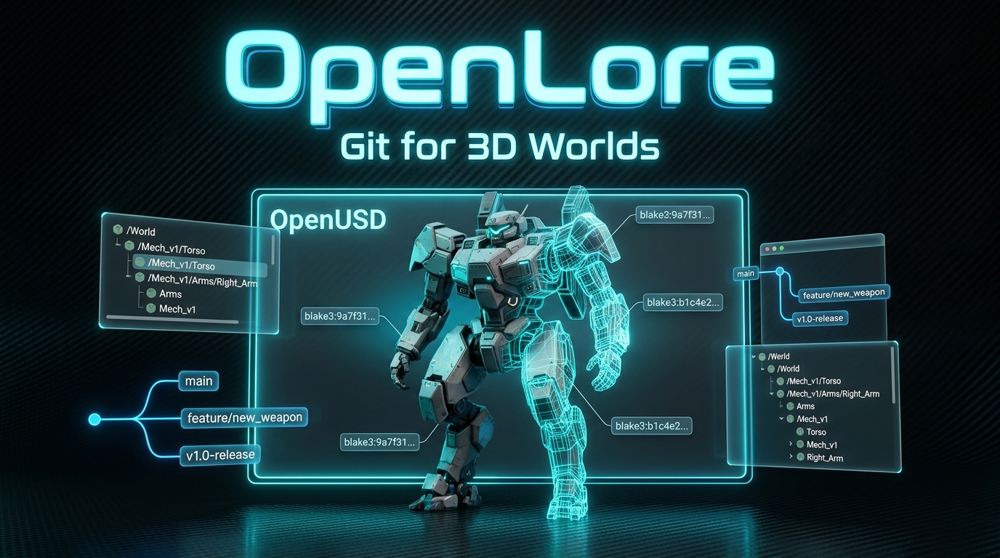
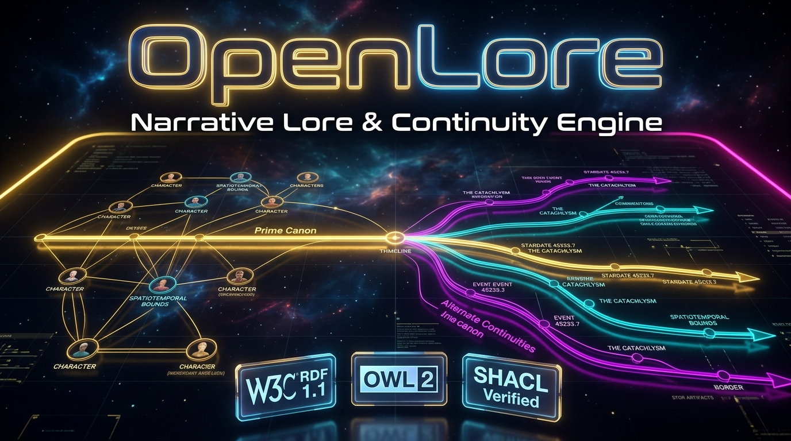
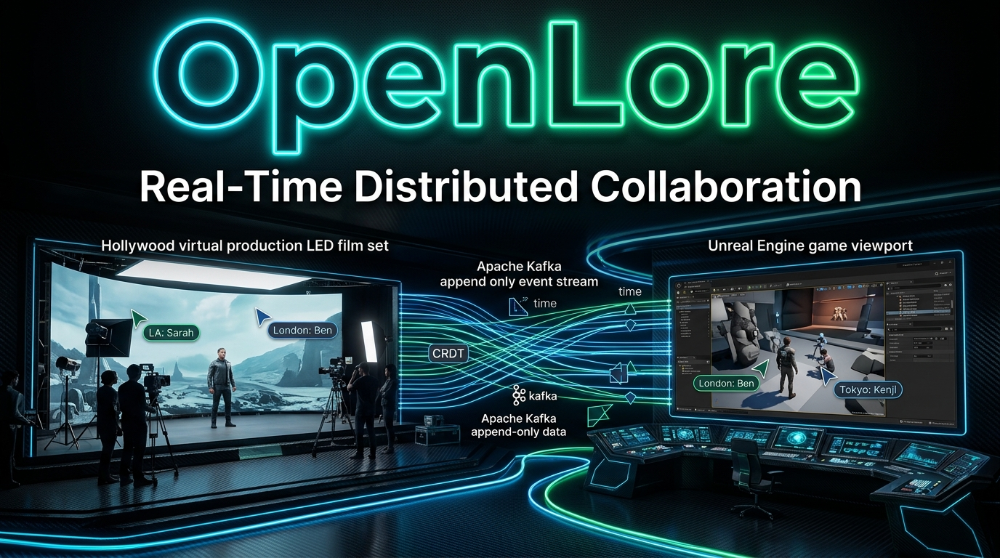
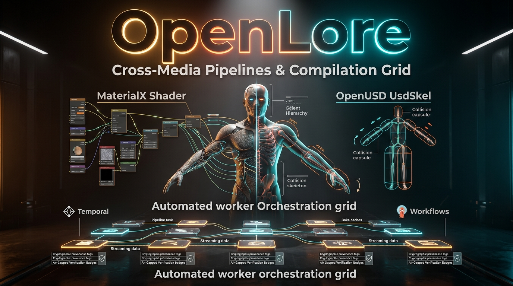

<p align="center">
  
</p>

# OpenLore

<p align="center">
  <strong>Git for 3D worlds, game lore, and Hollywood pipelines.</strong>
</p>

<p align="center">
  <a href="#license"></a>
  <a href="#python"></a>
  <a href="#openusd"></a>
  <a href="#w3c-rdf"></a>
  <a href="#crdt"></a>
  <a href="#opa"></a>
  <a href="#temporal"></a>
  <a href="#tests"></a>
</p>

---

## Executive Summary

Modern entertainment franchises span feature films, AAA games, television series, virtual production volumes, and consumer merchandise. Yet digital asset management remains fragmented:
* **VFX and Film** rely on deep, non-linear [OpenUSD (Universal Scene Description)](https://openusd.org/) layer stacks, MaterialX shading networks, and terabyte-scale cinematic point caches.
* **Game Engines (Unreal Engine / Unity)** require flattened skeletal hierarchies, collision hulls, platform-specific pak files, and low-latency physics runtimes.
* **Narrative & Franchise Lore** is scattered across wikis and design docs with zero automated continuity enforcement or chronological integrity validation.
* **Collaborative DCC Tools** lack Git-style distributed branching, forcing studios to lock files or risk conflicting overrides across global sites.

**OpenLore** resolves this cross-media disconnect. It is a unified, enterprise-grade production backbone that marries **OpenUSD composition stages** and **immutable BLAKE3 Content-Addressed Storage (CAS)** with **semantic W3C RDF 1.1 lore graphs**, **Kafka/CRDT real-time vector clock synchronization**, **eBPF partner enclave sandboxing**, **OPA Rego royalty accounting**, and **Temporal/Argo compilation grids**.

---

## Architectural Pillar Gallery

<table width="100%">
  <tr>
    <td width="50%" align="center" valign="top">
      <a href="#1-openusd-storage--blake3-cas">
        
      </a>
      <br />
      <strong>1. OpenUSD Storage & BLAKE3 CAS</strong>
      <p><em>Layered USD composition stages, non-destructive branching, and sharded cryptographic content-addressed storage (Local & S3).</em></p>
    </td>
    <td width="50%" align="center" valign="top">
      <a href="#2-narrative-multiverse--graph-rag-assistant">
        
      </a>
      <br />
      <strong>2. Narrative Multiverse & Continuity Engine</strong>
      <p><em>W3C RDF 1.1 semantic lore graphs, SHACL shape validation, alternate timeline branching, and SPARQL Graph RAG narrative intelligence.</em></p>
    </td>
  </tr>
  <tr>
    <td width="50%" align="center" valign="top">
      <a href="#3-distributed-collaboration--crdt-sync">
        
      </a>
      <br />
      <strong>3. Distributed Multi-Studio Collaboration</strong>
      <p><em>Vector clocks, sparse CRDT LWW registers, Apache Kafka event streams, and offline edge shadow buffer resilience.</em></p>
    </td>
    <td width="50%" align="center" valign="top">
      <a href="#4-cross-media-compilation-grid--opa-provenance">
        
      </a>
      <br />
      <strong>4. Cross-Media Pipelines & Compilation Grid</strong>
      <p><em>Unreal Live Link telemetry (60 FPS UDP), partner decimation (1%-100%), OPA royalty evaluation, and Temporal worker build grids.</em></p>
    </td>
  </tr>
</table>

---

## System Architecture

```
                                  [ OpenLore Studio Cockpit (Web SPA / Three.js Viewport) ]
                                                            │
                       ┌────────────────────────────────────┼────────────────────────────────────┐
                       │                                    │                                    │
                       ▼                                    ▼                                    ▼
             [ REST API & WebSockets ]              [ OpenUSD Wasm ]                 [ SPARQL Graph RAG ]
            (Python ThreadingHTTPServer)           (In-Browser USDA)                  (Dynamic Assistant)
                       │                                    │                                    │
       ┌───────────────┴───────────────┐                    │                                    │
       ▼                               ▼                    │                                    ▼
[ Core Storage & Stages ]    [ Real-Time Sync ]             │                        [ Narrative Knowledge ]
 • BLAKE3 CAS (Local / S3)    • Apache Kafka Stream         │                         • W3C RDF 1.1 Named Graphs
 • OpenUSD Stage Manager      • Vector Clocks (T=N)         │                         • OWL 2 Universe Ontology
 • Atomic Commit Engine       • Sparse CRDT (LWW / ORSet)   │                         • SHACL Continuity Engine
       │                      • Edge Shadow Buffering       │                         • Prime vs. Alternate Timelines
       │                               │                    │                                    │
       ├───────────────────────────────┴────────────────────┴────────────────────────────────────┤
       ▼                                                                                         ▼
[ Partner Enclave Security ]                                                            [ Cross-Media Grid ]
 • Outbound Decimation (1% - 100%)                                                       • Unreal Engine 5 Live Link (UDP)
 • Neutral Clay Shader Override                                                          • Blender 4.x & Maya Connectors
 • Quarantined Pre-Flight Linter                                                         • OPA Rego Royalty Evaluator
 • TD 1-Click Optimistic Lock Gate                                                       • Temporal / Argo Compilation Grid
 • eBPF Zero-Egress Kernel Filters                                                       • Production Catalog (PostgreSQL)
```

---

## Core Capabilities

### 1. OpenUSD Storage & BLAKE3 CAS
* **Strict Separation of Concerns**: Lightweight transactional edits (metadata, transform deltas, variant switches) are isolated from gigabyte-scale binary payloads (geometry meshes, 8K UDIM textures, Alembic point caches).
* **Sharded Content-Addressed Storage**: Pure Python, zero-dependency CAS indexed by 256-bit BLAKE3 hashes with 2-level directory sharding (`objects/aa/bb/aabb...`).
* **Cloud S3 Adapter**: High-throughput `S3CASBackend` with native, zero-dependency AWS SigV4 request signing supporting AWS S3, Cloudflare R2, MinIO, and Ceph.
* **Atomic Stage Composition**: Non-destructive layer stacks, sublayer referencing, and commit chains with full git-style SHA-1 provenance log.

### 2. Narrative Multiverse & SPARQL Graph RAG
* **W3C Semantic Foundation**: Narrative lore, character lifecycles, and asset bindings modeled as RDF 1.1 triples inside Named Graphs (`openlore:canon:prime`).
* **Automated SHACL Validation**: Asynchronous continuity engine enforcing temporal invariants (e.g. characters cannot participate in battles before birth or after death).
* **Multiverse Branching**: Fork prime canon into isolated timeline namespaces (`openlore:branch:dark_timeline`) for alternate adaptations without polluting prime continuity.
* **Studio Copilot Graph RAG Assistant**: Natural language query interface powered by dynamic SPARQL synthesis, extracting relevant triples, verifying temporal bounds, and formatting verified context for creative writers.

### 3. Distributed Collaboration & CRDT Vector Clocks
* **Sparse CRDT Registers**: Last-Write-Wins (LWW) registers resolving concurrent multi-studio edits deterministically using:
  1. Causal dominance via monotonic **Vector Clocks**
  2. Nanosecond wall-clock timestamps
  3. Deterministic studio ID tie-breaking
* **Event Stream Architecture**: Real-time mutation broadcast over Apache Kafka / Redpanda. High-frequency transformations travel as tiny JSON payloads (<64 KB).
* **Offline Resilience**: When internet connectivity drops, the local **Edge Resolver Daemon** switches to shadow storage, buffering all artist edits locally. Upon reconnect, buffered edits flush atomically and merge into the global stage without data loss.

### 4. Unreal Engine 5 Live Link Bridge & DCC Connectors
* **Duplex Live Link Telemetry**: Real-time UDP broadcasting (port `11111` at 60 FPS) translating OpenUSD right-handed coordinate frames into Unreal Engine left-handed centimeters (Z-up).
* **C++ Plugin Scaffolding**: Turnkey Unreal Engine 5 plugin authoring (`.uplugin`, `Build.cs`, `ILiveLinkSource`, Python bridge).
* **DCC Connectors**: Zero-dependency turnkey modal add-ons for **Blender 4.x** and **Autodesk Maya 2024/2025** streaming active viewport camera transforms into OpenLore stages.

### 5. Partner Enclave Security & Ingestion
* **Outbound IP Sanitization**: Adjustable geometric decimation slider (**1% to 100%**) generating low-res proxy hulls, stripping proprietary attributes (`assetHash`, `pointCacheHash`, `royaltyPercentage`), and replacing proprietary lookdev with neutral clay shaders.
* **Inbound Quarantined Linter**: Pre-flight USD sandbox auditing external deliverables against polycount ceilings, scene hierarchy rules (`/World`, `/Root`), and namespace conventions.
* **TD 1-Click Promotion Gate**: Technical Directors acquire an optimistic concurrency lock token, verify SHACL lore compliance, and atomically append approved deliverables into the production USD stage stack.
* **eBPF Zero-Egress Kernel Security**: Generates Linux TC eBPF programs blocking unauthorized contractor outbound network packets at the socket level.

### 6. Automated Asset Provenance & OPA Royalties
* **Stage DAG Harvester**: Introspects the entire directed acyclic graph of active USD stages, extracting all referenced sublayers, asset hashes, prim paths, and contributing studio IDs.
* **HMAC-SHA256 Cryptographic Signatures**: Tamper-proof manifest signing ensuring supply chain integrity.
* **OPA Rego Royalty Compliance**: Evaluates manifests against Open Policy Agent Rego rules, calculating automated percentage splits (e.g. London VFX, LA Game, Tokyo Lookdev, Montreal Rigging) and gating downstream commercial release.

### 7. Compilation Grid & Central Production Catalog
* **Temporal Orchestration & Argo DAGs**: Automated downstream compilation into targeted game engine packages (`.pak` for Unreal Engine 5, `.unitypackage` for Unity 6) and cinematic USD point caches.
* **Relational Production Catalog**: Industrial ledger backed by SQLite (local development) or PostgreSQL 16 (staging/production) with indexed lookups on stage URI, build type, and BLAKE3 CAS hash.

### 8. OpenLore Studio Cockpit (Web UI)
* Full-featured React 19 single-page application served directly by OpenLore embedded web server:
  - **Tab 1: 3D Stage Viewport**: In-browser Three.js viewport powered by a client-side OpenUSD WebAssembly parser and Scenegraph Prim Inspector.
  - **Tab 2: Narrative Multiverse**: Timeline manager, SHACL integrity monitor, and interactive SPARQL Graph RAG narrative assistant.
  - **Tab 3: Studio Collaboration**: Multi-studio vector clock monitors, CRDT broadcaster, network severance simulator, and UE5 Live Link status.
  - **Tab 4: Partner Enclave**: 1%–100% IP decimation controls, presets, quarantine linter, and 1-Click TD promotion gate.
  - **Tab 5: Provenance & OPA**: Cryptographic signature verifier, partner royalty progress bars, and harvested USD DAG tree.
  - **Tab 6: Compilation Grid**: Multi-target engine selection, live Temporal activity tracker, and Central Production Catalog.

---

## Quickstart Guide

### Prerequisites
* **Python**: `3.11` or higher.
* **Node.js** *(optional, for UI development)*: `v18+` (pre-compiled web assets are included in `web/dist`).

### 1. Installation

Clone the repository and install OpenLore in editable development mode:

```bash
git clone git@github.com:epicbrain-dev/openlore.git
cd openlore
pip install -e .
```

To install optional developer dependencies (pytest, ruff, mypy):
```bash
pip install -e ".[dev]"
```

### 2. Launch OpenLore Studio Cockpit

Start the embedded REST API server and web cockpit:
```bash
openlore web --port 8000
```
Open your browser and navigate to:
```
http://localhost:8000
```

### 3. Verify System Health

Check server status directly from your terminal:
```bash
curl -s http://localhost:8000/api/status | python3 -m json.tool
```

Output:
```json
{
    "status": "ONLINE",
    "version": "1.0.0",
    "environment": "development",
    "cas_backend": "filesystem",
    "catalog_backend": "json",
    "system": "OpenLore Transmedia Production Backbone",
    "services": {
        "openusd": "Active",
        "rdf_triplestore": "Active",
        "crdt_resolver": "Active",
        "opa_accounting": "Active",
        "temporal_grid": "Active",
        "graph_rag": "Active"
    }
}
```

---

## CLI Command Reference

OpenLore provides a comprehensive CLI for technical directors and pipeline engineers:

| Command | Action / Arguments | Description |
| :--- | :--- | :--- |
| `openlore init` | `--cas-path <DIR> --canon <NAME>` | Initialize CAS repository structure and prime canon lore graph. |
| `openlore stage` | `create`, `list`, `inspect` | Create OpenUSD stages, inspect prims, and manage sublayer stacks. |
| `openlore lore` | `verify`, `branch`, `list`, `export` | Validate SHACL narrative shapes, branch alternate timelines, export TriG. |
| `openlore daemon` | `start`, `status`, `stop` | Manage Edge Resolver daemon, vector clocks, and offline shadow buffers. |
| `openlore partner` | `sanitize`, `lint`, `promote` | Execute 1%-100% IP decimation, quarantine linting, and TD promotion. |
| `openlore compile` | `--stage <URI> --target <ENGINES>` | Dispatch Temporal compilation workflows (Unreal, Unity, Shot caches). |
| `openlore catalog` | `list` | Inspect registered builds and BLAKE3 CAS hashes in production catalog. |
| `openlore export` | `--stage <URI> --target <ENGINE>` | Introspect USD DAG, evaluate OPA royalties, and compile packages. |
| `openlore web` | `--host <IP> --port <PORT>` | Launch embedded REST server, WebSocket gateway, and Web Cockpit. |
| `openlore livelink`| `stream`, `export-plugin` | Run real-time UE5 Live Link bridge or export turnkey C++ plugin project. |
| `openlore auth` | `create-token` | Generate HMAC-SHA256 bearer tokens with RBAC permission scopes. |
| `openlore dcc` | `blender`, `maya`, `all` | Export turnkey telemetry bridge add-ons for Blender and Maya. |

---

## Python SDK Examples

### Composing OpenUSD Stages & Binding CAS Assets
```python
from pathlib import Path
from openlore.core.cas import ContentAddressedStorage
from openlore.core.stage import StageCompositionManager
from openlore.core.transaction import TransactionManager

# 1. Store immutable geometry mesh into CAS
cas = ContentAddressedStorage(Path("./data/cas"))
hero_mesh_cas = cas.store_bytes(b"SOLID_GEOMETRY_BUFFER_BYTES", mime_type="model/vnd.usda")
print(f"Stored Mesh CAS Hash: {hero_mesh_cas.blake3_hash}")

# 2. Compose OpenUSD stage
stage_mgr = StageCompositionManager(Path("./data/stages"))
stage_ref = stage_mgr.create_stage("openlore://stages/hero_scene.usda")

# 3. Transactional authoring & asset binding
tx_mgr = TransactionManager(Path("./data"), stage_mgr)
session = tx_mgr.begin_transaction(stage_ref, author="alice_lead_td")
session.set_property("/World/Hero", "xformOp:translate", [0.0, 10.0, 0.0])
session.attach_cas_payload("/World/Hero", "openlore:assetHash", hero_mesh_cas)
commit_record = session.commit("Add Hero character with CAS bound mesh")
print(f"Committed Transaction: {commit_record.commit_id}")
```

### Querying Lore via SPARQL Graph RAG Assistant
```python
from openlore.narrative.rag import NarrativeGraphRAG

# Initialize Graph RAG assistant
assistant = NarrativeGraphRAG(graph_path="data/lore/graph.trig")

# Query lore continuity
response = assistant.answer_query(
    "What events did Commander Vance participate in, and what are the timeline constraints?"
)

print("Synthesized SPARQL Query:\n", response["sparql_query"])
print("Retrieved Triples:\n", response["triples"])
print("Continuity Analysis:\n", response["answer"])
```

### Real-Time CRDT Collaborative Edits
```python
from openlore.collaboration.daemon import EdgeResolverDaemon
from openlore.collaboration.stream import KafkaEventStream

stream = KafkaEventStream("openlore.stage.hero", use_memory_bus=True)
daemon = EdgeResolverDaemon("studio_london", "openlore://stages/hero_scene.usda", stream)

# Record local edit (broadcasting over Kafka with Vector Clock)
daemon.record_local_edit("/World/Hero", "xformOp:translate", [15.0, 10.0, 5.0])
print(f"Current Vector Clock: {daemon.vector_clock.clocks}")

# Simulate network severance -> automatic shadow buffering
daemon.sever_network()
daemon.record_local_edit("/World/Hero", "xformOp:translate", [16.0, 10.0, 5.0])
print(f"Buffered Edits: {daemon.shadow_buffer_size}")

# Restore network -> atomic flush and causal state convergence
daemon.restore_network()
print(f"Buffer flushed! Online status: {daemon.is_online}")
```

---

## Staging & Production Deployment

OpenLore includes production-grade container orchestration configurations:

### Multi-Container Staging Stack (`docker compose`)
The staging profile orchestrates:
- **OpenLore Server & Cockpit** (Port `8080`)
- **PostgreSQL 16** (Central Production Catalog)
- **MinIO S3** (Scalable Object Storage for CAS)
- **Redpanda** (High-throughput Kafka-compatible event streaming)
- **Open Policy Agent (OPA)** (Royalty policy evaluation)
- **Apache Jena Fuseki** (RDF SPARQL 1.1 Triplestore)

To spin up the entire staging infrastructure:
```bash
docker compose -f docker-compose.staging.yml up -d
```

### Automated Staging Deployment Script
```bash
./scripts/deploy_staging.sh
```

### Kubernetes Helm Deployment
```bash
helm upgrade --install openlore ./helm/openlore \
  --namespace openlore-staging --create-namespace \
  -f ./helm/openlore/values-staging.yaml
```

---

## Repository Structure

```
openlore/
├── assets/                       # Hero header banner and architectural pillar thumbnails
│   ├── hero-banner.jpg
│   └── thumbnails/
│       ├── 01-openusd-storage.jpg
│       ├── 02-narrative-ontology.jpg
│       ├── 03-distributed-collaboration.jpg
│       └── 04-crossmedia-compilation.jpg
├── data/                         # Canonical lore graph & seed data
│   └── lore/
│       └── graph.trig
├── docker/                       # Container definitions for runtime components
│   ├── Dockerfile.server
│   └── Dockerfile.worker
├── docs/                         # Detailed architecture documentation
│   ├── API_REFERENCE.md          # Complete Python and REST API reference
│   └── DEPLOYMENT_RUNBOOK.md     # Production deployment and operational runbook
├── helm/                         # Kubernetes Helm charts
│   └── openlore/
│       ├── Chart.yaml
│       ├── values.yaml
│       └── values-staging.yaml
├── schemas/                      # Formal W3C OWL 2, SHACL, and OPA Rego schemas
│   ├── opa/
│   │   └── royalties.rego
│   └── shacl/
│       └── continuity_rules.ttl
├── scripts/                      # Deployment and pipeline orchestration scripts
│   ├── deploy_staging.sh
│   └── seed_graph.py
├── src/
│   └── openlore/                 # Core Python runtime package
│       ├── bridge/               # Unreal Live Link bridge & DCC connectors
│       ├── cli/                  # Production command-line interface
│       ├── collaboration/        # CRDTs, Vector Clocks, Kafka & Edge Daemons
│       ├── compilation/          # Temporal workflows, Argo DAGs & Catalog Backends
│       ├── core/                 # BLAKE3 CAS (Local & S3), USD Stages, Transactions
│       ├── dcc/                  # Blender 4.x and Autodesk Maya sidecars
│       ├── materials/            # MaterialX translators & UsdSkel dual-rigs
│       ├── narrative/            # RDF triplestore, OWL 2, SHACL & Graph RAG
│       ├── partner/              # IP decimation (1%-100%), quarantine linter, TD gates
│       ├── provenance/           # OpenUSD DAG harvester, HMAC manifests, OPA
│       ├── server/               # HTTP REST API, WebSocket gateway & SPA host
│       └── config.py             # Environment configuration (Dev, Staging, Prod)
├── tests/                        # Comprehensive test suite (101/101 passing)
│   ├── integration/
│   └── unit/
├── web/                          # OpenLore Studio Cockpit (React 19 + Three.js)
│   ├── dist/                     # Pre-compiled static production bundle
│   └── src/
│       ├── components/
│       ├── utils/                # Client-side OpenUSD WebAssembly parser
│       └── views/                # Six production cockpit views
├── docker-compose.yml            # Local development orchestration
├── docker-compose.staging.yml    # Full enterprise staging environment profile
├── pyproject.toml                # Standard PEP 517/518 build configuration
└── Documentation.md              # Complete technical whitepaper
```

---

## Test Suite & Verification

OpenLore includes a rigorous unit and integration test suite covering all domains:

```bash
python3 -m unittest discover tests/
```

```
Ran 101 tests in 3.09s
OK
```

Test coverage includes:
- `tests/unit/test_core.py`: BLAKE3 CAS sharding, S3 SigV4 requests, Stage composition, and transactions.
- `tests/unit/test_narrative.py`: Named graphs, OWL lifecycles, and SHACL continuity constraints.
- `tests/unit/test_narrative_rag.py`: SPARQL Graph RAG synthesis, intent extraction, and timeline bounds.
- `tests/unit/test_collaboration.py`: Vector clock causal dominance, sparse CRDT LWW convergence, and shadow buffers.
- `tests/unit/test_partner.py`: Mesh decimation (1%-100%), clay shaders, quarantine linting, and TD optimistic locks.
- `tests/unit/test_provenance.py`: OpenUSD DAG prim harvesting, HMAC-SHA256 manifests, and OPA Rego royalties.
- `tests/unit/test_compilation.py`: Temporal activity generators, Argo DAGs, and Relational Catalog (SQLite/Postgres).
- `tests/unit/test_bridge.py`: Unreal Engine 5 Live Link coordinate conversions and packet telemetry.
- `tests/unit/test_dcc.py`: Blender 4.x and Autodesk Maya connector generators.
- `tests/integration/test_pipeline_flow.py`: Complete end-to-end transmedia production pipeline flow.

---

## License

This project is licensed under the **Apache License 2.0**. See the [Documentation.md](Documentation.md#licensing--legal-terms) for complete legal terms.

```
Copyright 2026 EpicBrain-Dev

Licensed under the Apache License, Version 2.0 (the "License");
you may not use this file except in compliance with the License.
You may obtain a copy of the License at

    http://www.apache.org/licenses/LICENSE-2.0
```
